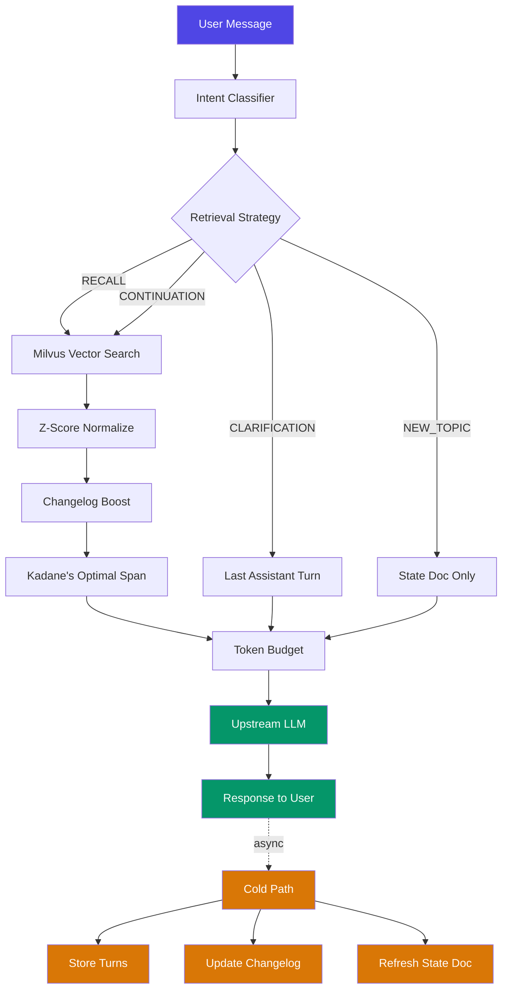
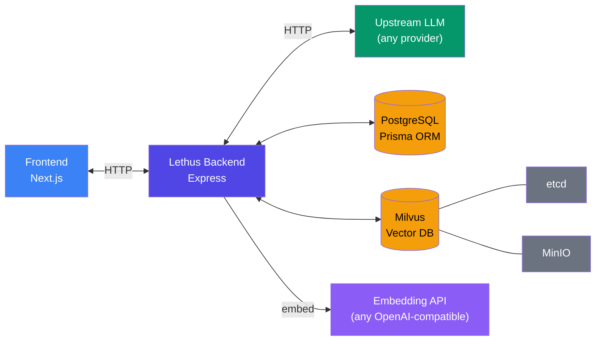
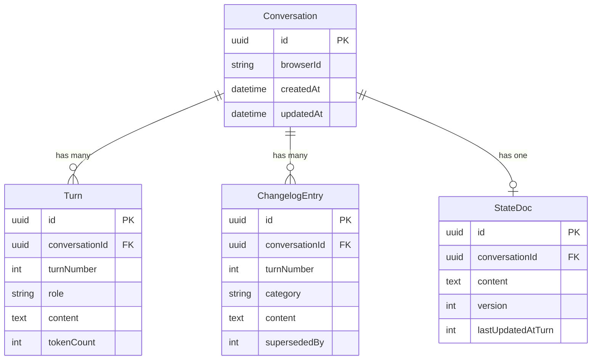
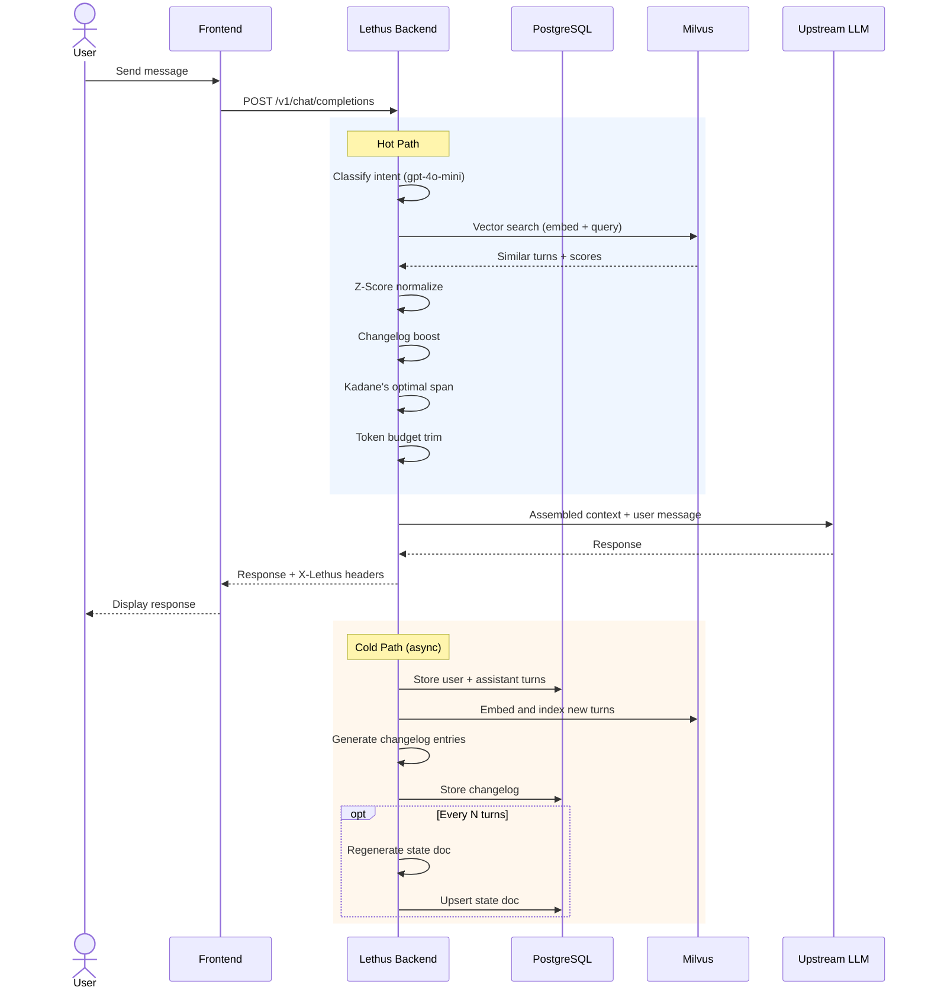

# Lethus

**Drop-in LLM context proxy that slashes token costs by sending only what matters.**

> Built for **HackSRM 7.0** by [teamCookie()](https://github.com/0xteamCookie)

Every LLM API call replays the entire conversation history. At turn 40, you're paying for 39 turns of context the model doesn't need. Lethus sits between your app and any LLM, classifies user intent, retrieves only the relevant history via vector search, and assembles a minimal context window -- cutting token usage by up to **4x**.

---

## How It Works



### Hot Path (per-request, blocks response)

| Step | Module | What it does |
|------|--------|--------------|
| 1 | **Intent Classifier** | Classifies the user message as `RECALL`, `CONTINUATION`, `CLARIFICATION`, or `NEW_TOPIC` |
| 2 | **Vector Retrieval** | Embeds the query via a configurable embedding model and searches Milvus for similar turns |
| 3 | **Z-Score Normalization** | Normalizes cosine similarity scores so irrelevant chunks drop below zero |
| 4 | **Changelog Boost** | Upweights turns referenced by active changelog entries (decisions, issues, resolutions) |
| 5 | **Kadane's Algorithm** | Finds the contiguous span of turns with maximum cumulative signal |
| 6 | **Token Budget** | Trims the selected span to fit within `RETRIEVAL_TOKEN_BUDGET` |

### Cold Path (post-response, non-blocking)

| Step | What it does |
|------|--------------|
| Store turns | Persists user + assistant messages to PostgreSQL and embeds them into Milvus |
| Changelog | Appends categorized entries (`DECISION`, `UPDATE`, `ISSUE`, `RESOLUTION`, `CONTEXT`) via LLM |
| State Doc | Regenerates a structured summary of the conversation every `STATE_DOC_UPDATE_INTERVAL` turns |

---

## Architecture



---

## Tech Stack

### Backend (`/backend`)

| Layer | Technology |
|-------|-----------|
| Runtime | Node.js + Express 5 |
| Language | TypeScript (tsx) |
| Relational DB | PostgreSQL 16 via Prisma ORM |
| Vector DB | Milvus 2.6 (etcd + MinIO) |
| Embeddings | Any OpenAI-compatible embedding API (default: `text-embedding-3-small`, 1536-dim) |
| Tokenizer | `gpt-tokenizer` |
| Infra | Docker Compose |

### Frontend (`/frontend`)

| Layer | Technology |
|-------|-----------|
| Framework | Next.js 16 |
| Language | TypeScript + React 19 |
| Styling | Tailwind CSS 4 |
| Markdown | `react-markdown` + `remark-gfm` |

---

## Project Structure

```
Lethus/
├── backend/
│   ├── src/
│   │   ├── algorithm/         # Core retrieval pipeline
│   │   │   ├── contextAssembler.ts   # Orchestrates the full hot path
│   │   │   ├── zscore.ts             # Z-score normalization
│   │   │   ├── kadane.ts             # Optimal span selection
│   │   │   ├── boost.ts              # Changelog-based score boosting
│   │   │   └── budget.ts             # Token budget enforcement
│   │   ├── services/          # Business logic
│   │   │   ├── intent.ts             # LLM-based intent classification
│   │   │   ├── statedoc.ts           # Living state document management
│   │   │   ├── changelog.ts          # Append-only change tracking
│   │   │   ├── llm.ts                # Upstream LLM calls
│   │   │   ├── turnStorage.ts        # Turn persistence + embeddings
│   │   │   ├── tokenizer.ts          # Token counting
│   │   │   └── writeback.ts          # Async cold path orchestrator
│   │   ├── proxy/
│   │   │   └── handler.ts            # OpenAI-compatible proxy endpoint
│   │   ├── db/                # Prisma + Milvus clients
│   │   ├── scripts/           # Dev utilities (init, reset, verify, demo)
│   │   ├── config.ts          # Environment config
│   │   ├── types.ts           # Shared type definitions
│   │   └── index.ts           # Express server + API routes
│   ├── prisma/
│   │   └── schema.prisma      # DB schema (Conversation, Turn, Changelog, StateDoc)
│   └── docker-compose.yml     # PostgreSQL + Milvus + etcd + MinIO
│
├── frontend/
│   ├── app/
│   │   ├── chat/              # Chat interface (new + [conversationId])
│   │   └── present/           # Interactive presentation deck
│   ├── component/
│   │   ├── present/           # Slide components
│   │   │   ├── ProblemSlide.tsx       # Full history vs. summarization vs. RAG
│   │   │   ├── OurSolutionSlide.tsx   # Live state tracking demo
│   │   │   ├── IntentSlide.tsx        # Intent classification walkthrough
│   │   │   ├── ZNormSlide.tsx         # Z-normalization visualization
│   │   │   └── KadaneSlide.tsx        # Kadane's span selection demo
│   │   ├── chatInput.tsx      # Message input component
│   │   ├── messageList.tsx    # Conversation display
│   │   ├── rightPanel.tsx     # Observability sidebar
│   │   ├── sideNavbar.tsx     # Conversation list + navigation
│   │   └── greet.tsx          # Welcome screen
│   └── lib/                   # Hooks and utilities
│
└── LICENSE                    # MIT
```

---

## Getting Started

### Prerequisites

- **Node.js** ≥ 18
- **Docker** + Docker Compose
- **LLM API key** (any OpenAI-compatible provider — OpenAI, Groq, Together, Ollama, etc.)

### 1. Clone and install

```bash
git clone https://github.com/0xteamCookie/Lethus.git
cd Lethus
```

```bash
# Backend
cd backend
npm install

# Frontend
cd ../frontend
npm install
```

### 2. Configure environment

```bash
cd backend
cp .env.example .env
# Edit .env — set your API keys and upstream LLM URL
```

### 3. Start infrastructure

```bash
cd backend
docker compose up -d
```

This starts PostgreSQL, Milvus, etcd, and MinIO.

### 4. Initialize databases

```bash
# Generate Prisma client + run migrations
npm run db:generate
npm run db:migrate

# Create Milvus collection for embeddings
npm run init:milvus
```

### 5. Start the servers

```bash
# Terminal 1 — Backend (port 8000)
cd backend
npm run dev

# Terminal 2 — Frontend (port 3000)
cd frontend
npm run dev
```

### 6. Use it

- **Chat UI**: [http://localhost:3000/chat](http://localhost:3000/chat)
- **Presentation**: [http://localhost:3000/present](http://localhost:3000/present)
- **Health check**: [http://localhost:8000/health](http://localhost:8000/health)

---

## API — Drop-in LLM Proxy

Lethus exposes an OpenAI-compatible `/v1/chat/completions` endpoint. Point any client at `http://localhost:8000`:

```python
import openai

client = openai.OpenAI(
    base_url="http://localhost:8000/v1",
    api_key="your-key",
    default_headers={
        "X-Lethus-Conversation-Id": "your-uuid",  # optional
    },
)

response = client.chat.completions.create(
    model="gpt-4o",
    messages=[{"role": "user", "content": "Hello!"}],
)
```

### Response Headers

| Header | Description |
|--------|-------------|
| `X-Lethus-Conversation-Id` | UUID for this conversation |
| `X-Lethus-Reduction-Percent` | Token reduction percentage achieved |
| `X-Lethus-Intent` | Classified intent of the user message |
| `X-Lethus-Processing-Ms` | Time spent in the retrieval pipeline |

---

## Configuration

All tuning parameters are set via environment variables (see `.env.example`):

| Variable | Default | Description |
|----------|---------|-------------|
| `COLD_START_THRESHOLD` | `5` | Turns before retrieval pipeline activates (before this, all turns are sent) |
| `RETRIEVAL_TOKEN_BUDGET` | `2000` | Max tokens for retrieved context |
| `RECENT_TURNS_COUNT` | `3` | Turns included for `CONTINUATION` intent |
| `STATE_DOC_UPDATE_INTERVAL` | `3` | Turns between state document regeneration |
| `KADANE_THETA` | `1.0` | Sensitivity for Kadane's span selection |
| `GAIN_SHIFT` | `0.6` | Baseline shift for gain scores (higher = stricter filtering) |
| `CHANGELOG_BOOST` | `1.0` | Score boost for turns with active changelog entries |
| `CHANGELOG_NEIGHBOR_BOOST` | `0.3` | Score boost for turns adjacent to changelog-referenced turns |

---

## Data Model



- **Turn** -- individual user/assistant messages with token counts
- **ChangelogEntry** -- categorized log of decisions, updates, issues, and resolutions (supersedable)
- **StateDoc** -- living structured summary, regenerated periodically via LLM

---

## Request Lifecycle



---

## Demo

> Screenshots and demo video coming soon.

<!--
Add your demo content here:
- Screen recording / GIF of the chat UI
- Before vs after token usage comparison
- Screenshot of the observability panel
-->

---

## Scripts

```bash
npm run dev              # Start dev server with hot reload
npm run db:migrate       # Run Prisma migrations
npm run db:generate      # Regenerate Prisma client
npm run init:milvus      # Create Milvus collection
npm run reset:milvus     # Drop and recreate Milvus collection
npm run verify           # Verify all connections (Postgres, Milvus, embedding API)
npm run test:services    # Run service integration tests
npm run demo             # Run a demo conversation
```

---

## License

[MIT](LICENSE) -- teamCookie()
