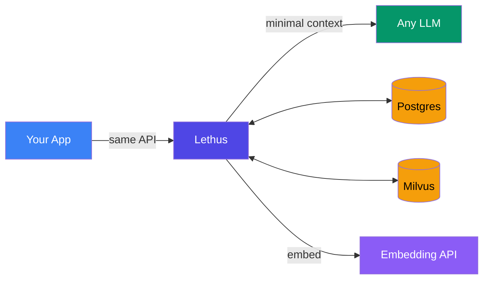
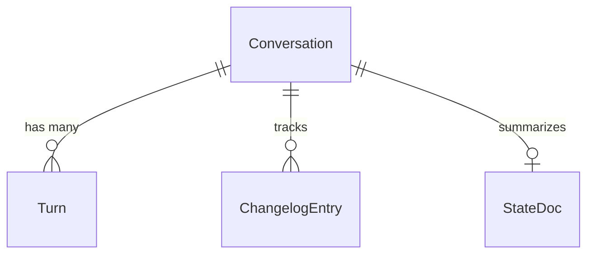

<div align="center">

<br>

# `Lethus`

**Stop paying your LLM to re-read the conversation.**

Drop-in proxy &middot; OpenAI-compatible &middot; Up to 4x token reduction

<br>

Built by [teamCookie()](https://github.com/0xteamCookie)

[Live Demo](https://lethus.getmyroom.in) &middot; [Presentation](https://lethus.getmyroom.in/present)

[](https://youtu.be/FpiByIk7wnc)

<br>

</div>

---

### The problem is simple.

Every API call sends the full conversation. Turn 40 means the model re-reads 39 turns it already processed. You pay for all of them.

```
Turn  1 ──────    50 tokens    ■
Turn  5 ──────   450 tokens    ■■■■■
Turn 10 ──────  1800 tokens    ■■■■■■■■■■■■■■
Turn 20 ────── 4,800 tokens    ■■■■■■■■■■■■■■■■■■■■■■■■■■■■■■■■
Turn 40 ────── 12000 tokens    ■■■■■■■■■■■■■■■■■■■■■■■■■■■■■■■■■■■■■■■■■■■■■■■■■■
                                                                  ↑ you pay for this
```

Three approaches exist. All are broken:

| Approach | What it does | What breaks |
|----------|-------------|-------------|
| **Full History** | Send everything | Tokens explode. Cost explodes. |
| **Summarization** | Compress to a paragraph | Decisions vanish. Detail is lost. |
| **Top-K RAG** | Retrieve scattered chunks | Reasoning continuity is shattered. |

---

### Lethus is the fourth option.

It sits between your app and the LLM. It intercepts the full conversation, figures out what the model actually needs, and forwards a minimal context window -- preserving the reasoning chain the model depends on.

**What the model sees at Turn 20:**

```
Without Lethus (4,800 tokens):                 With Lethus (1,200 tokens):
┌──────────────────────────────────────┐        ┌──────────────────────────────────────┐
│  Turn  1: "Plan a trip to Japan"     │        │  [State Doc - 180 tokens]            │
│  Turn  2: "Sure! Here are ideas..."  │        │   Summary of trip: budget, dates,    │
│  Turn  3: "What about budget?"       │        │   decisions made so far...           │
│  Turn  4: "For budget travel..."     │        │                                      │
│  Turn  5: "How about hostels?"       │        │  Turn  7: "Budget is $3000 total"    │
│  Turn  6: "Great choice. Here..."    │        │  Turn  8: "Let's split it: $1200     │
│  Turn  7: "Budget is $3000 total"    │        │           flights, $1000 stay..."     │
│  Turn  8: "Let's split it..."        │        │  Turn  9: "Sounds good, booked."     │
│  Turn  9: "Sounds good, booked."     │        │                                      │
│  Turn 10: "What about food?"         │        │  Turn 18: "Book the Airbnb?"         │
│  Turn 11: "Here are options..."      │        │  Turn 19: "Yes, great choice."       │
│  Turn 12: "Let's go street food"     │        │  Turn 20: "What's the total budget?" │
│  Turn 13: "Perfect. Also..."         │        └──────────────────────────────────────┘
│  Turn 14: "What about transit?"      │           ↑ decisions preserved
│  Turn 15: "Get a JR Pass..."        │           ↑ reasoning chain intact
│  Turn 16: "Done. Now activities?"    │           ↑ 75% fewer tokens
│  Turn 17: "Here are top spots..."    │
│  Turn 18: "Book the Airbnb?"         │
│  Turn 19: "Yes, great choice."       │
│  Turn 20: "What's the total budget?" │
└──────────────────────────────────────┘
```

The model gets the state doc (what's been decided), the budget decision span (contiguous, not scattered), and the recent turns. Everything it needs. Nothing it doesn't.

---

### Two lines to switch.

```python
# Before -- direct to LLM
client = openai.OpenAI(api_key="sk-...")

# After -- through Lethus
client = openai.OpenAI(base_url="http://localhost:8000/v1", api_key="sk-...")
```

Same endpoint. Same request format. Same response schema. Streaming works.

Every response comes back with metadata:

```
X-Lethus-Conversation-Id:   a1b2c3d4-...
X-Lethus-Reduction-Percent:  72.3
X-Lethus-Intent:             RECALL
X-Lethus-Processing-Ms:      23
```

---

### What happens inside.

```
Message in
    │
    ├── 1. Intent ──────── RECALL | CONTINUATION | CLARIFICATION | NEW_TOPIC
    │
    ├── 2. Retrieve ────── Embed query → vector search → similar turns
    │
    ├── 3. Z-Score ─────── Normalize scores → noise drops below zero
    │
    ├── 4. Boost ───────── Upweight decisions, issues, resolutions
    │
    ├── 5. Kadane ──────── Find optimal contiguous span
    │
    └── 6. Budget ──────── Trim to token limit
    │
    ▼
LLM receives only what matters
    │
    ▼
Response out + async writeback
```

**Intent routing** means cheap queries stay cheap:

| Intent | What it means | Strategy | Cost |
|--------|--------------|----------|------|
| `CONTINUATION` | Follow-up to last message | Last 3 turns | Near zero |
| `CLARIFICATION` | "What do you mean?" | Last assistant response | Minimal |
| `NEW_TOPIC` | Subject change | State doc + recent turns | Low |
| `RECALL` | "What did we decide about...?" | Full retrieval pipeline | Worth it |

---

### Why Kadane's algorithm matters.

Standard RAG retrieves the top-K most similar chunks. They're scattered across the conversation. The model sees fragments without the connective tissue between them.

```
Top-K RAG (scattered):
  Turn 2 ██░░░░░░░░░░░░░░░░░░░░░░░░░░░░░░░░░░░░░░░░░░░░░░
  Turn 7 ░░░░░░██░░░░░░░░░░░░░░░░░░░░░░░░░░░░░░░░░░░░░░░░
  Turn 15 ░░░░░░░░░░░░░░██░░░░░░░░░░░░░░░░░░░░░░░░░░░░░░░░
  Turn 28 ░░░░░░░░░░░░░░░░░░░░░░░░░░░░██░░░░░░░░░░░░░░░░░░
  Turn 33 ░░░░░░░░░░░░░░░░░░░░░░░░░░░░░░░░░░██░░░░░░░░░░░░
         ↑ five fragments, no connecting context

Lethus + Kadane (contiguous):
  Turn 6 ░░░░░░████████████░░░░░░░░░░░░░░░░░░░░░░░░░░░░░░░
  Turn 7          ↑ coherent reasoning thread with full context
  Turn 8
  Turn 9
  Turn 10 ░░░░░░░░░░░░░░░░░░░░░░░░░░░░░░░░░░░░░░░░░░░░░░░
```

Kadane's maximum subarray algorithm finds the contiguous span with the highest cumulative signal. Multi-span variant finds up to 3 non-overlapping windows. The model reads a coherent thread, not a collage.

---

### The numbers.

| | Without Lethus | With Lethus | |
|--|:--:|:--:|--|
| Input tokens/month | 640M | **~430M** | **-33%** |
| Monthly cost | $3,200 | **$2,150** | |
| **Monthly savings** | | **~$1,050** | |
| **Annual savings** | | **~$12,600** | |

> *800M tokens/month, 80/20 input-output split, $5/M input pricing, Claude Opus 4.6.*

---

### Under the hood.

<details>
<summary><b>Z-Score Normalization</b> -- making similarity scores meaningful</summary>

<br>

Raw cosine similarity scores cluster in a tight band (0.82 -- 0.89). The difference between relevant and irrelevant is buried at the third decimal. Threshold-based filtering can't see it.

Z-score normalization transforms raw scores into "standard deviations from the mean." Relevant turns jump to +1.5, +2.0. Noise drops below zero. Kadane's gain threshold now works consistently across any query, any conversation length.

</details>

<details>
<summary><b>Changelog Boosting</b> -- semantic importance beyond embeddings</summary>

<br>

Some turns matter because of *what was decided*, not what was said. "Let's go with PostgreSQL" has low embedding similarity to a question about database performance -- but it's the most important turn in the thread.

Lethus tracks a structured changelog: `DECISION`, `UPDATE`, `ISSUE`, `RESOLUTION`, `CONTEXT`. Turns with changelog entries get boosted (+1.0). Their neighbors get a smaller boost (+0.3), because the reasoning leading to a decision matters too.

</details>

<details>
<summary><b>State Document</b> -- living memory of the conversation</summary>

<br>

Every N turns (default: 3), an LLM regenerates a structured summary of the conversation. This state doc captures the current understanding -- goals, decisions, open questions, resolved issues -- without replaying the full history.

For `NEW_TOPIC` intents, the state doc provides grounding context without expensive vector retrieval. It's the difference between "I know nothing about this conversation" and "here's where we stand."

</details>

<details>
<summary><b>Cold Path</b> -- async, non-blocking</summary>

<br>

After every response, Lethus fires an async writeback:

1. **Store turns** -- user + assistant messages --> PostgreSQL + Milvus embeddings
2. **Generate changelog** -- LLM extracts decisions, issues, resolutions from the exchange
3. **Refresh state doc** -- every N turns, regenerates the structured summary

The hot path stays fast. The cold path keeps the knowledge base current.

</details>

---

### Architecture.



Everything runs locally via Docker Compose. PostgreSQL stores conversations + changelogs. Milvus stores embeddings. Any OpenAI-compatible embedding API works.

---

### Stack.

| | Technology |
|--|--|
| **Backend** | Node.js &middot; Express 5 &middot; TypeScript |
| **Database** | PostgreSQL 16 &middot; Prisma ORM |
| **Vector DB** | Milvus 2.6 (etcd + MinIO) |
| **Embeddings** | Any OpenAI-compatible API (default: `text-embedding-3-small`) |
| **Frontend** | Next.js 16 &middot; React 19 &middot; Tailwind CSS 4 |
| **Infra** | Docker Compose |

---

### Get started.

**Prerequisites:** Node.js >= 18, Docker + Docker Compose, any OpenAI-compatible API key

```bash
git clone https://github.com/0xteamCookie/Lethus.git && cd Lethus
```

```bash
# Install
cd backend && npm install && cd ../frontend && npm install

# Configure
cd ../backend && cp .env.example .env
# Edit .env -- set your API keys and upstream LLM URL

# Infrastructure
docker compose up -d

# Initialize
npm run db:generate && npm run db:migrate && npm run init:milvus

# Run
npm run dev                        # backend  :8000
cd ../frontend && npm run dev      # frontend :3000
```

**Verify:** `http://localhost:8000/health` &middot; **Chat:** `http://localhost:3000/chat` &middot; **Presentation:** `http://localhost:3000/present`

---

<details>
<summary><b>Configuration</b></summary>

<br>

All tuning via environment variables (see `.env.example`):

| Variable | Default | What it does |
|----------|---------|-------------|
| `COLD_START_THRESHOLD` | `5` | Turns before retrieval pipeline activates |
| `RETRIEVAL_TOKEN_BUDGET` | `2000` | Max tokens for retrieved context |
| `RECENT_TURNS_COUNT` | `3` | Always-included recent turns |
| `KADANE_THETA` | `1.0` | Span selection sensitivity |
| `GAIN_SHIFT` | `0.6` | Baseline for gain scores |
| `CHANGELOG_BOOST` | `1.0` | Score boost for decision turns |
| `CHANGELOG_NEIGHBOR_BOOST` | `0.3` | Boost for adjacent turns |
| `STATE_DOC_UPDATE_INTERVAL` | `3` | Turns between state doc refresh |

</details>

<details>
<summary><b>Observability API</b></summary>

<br>

```
GET  /conversations                     # list all
GET  /conversations/:id                 # conversation details
GET  /conversations/:id/turns           # full turn history
GET  /conversations/:id/changelog       # decision log
GET  /conversations/:id/state           # current state doc
```

</details>

<details>
<summary><b>Data Model</b></summary>

<br>



- **Turn** -- messages with token counts, embedded into Milvus
- **ChangelogEntry** -- decisions, issues, resolutions (supersedable)
- **StateDoc** -- living summary, regenerated every N turns

</details>

<details>
<summary><b>Scripts</b></summary>

<br>

```bash
npm run dev              # Start dev server
npm run db:migrate       # Run Prisma migrations
npm run db:generate      # Regenerate Prisma client
npm run init:milvus      # Create Milvus collection
npm run reset:milvus     # Drop and recreate collection
npm run verify           # Verify all connections
npm run test:services    # Run service tests
npm run demo             # Run a demo conversation
```

</details>

---

<div align="center">

[MIT License](LICENSE) &middot; [teamCookie()](https://github.com/0xteamCookie)

</div>
